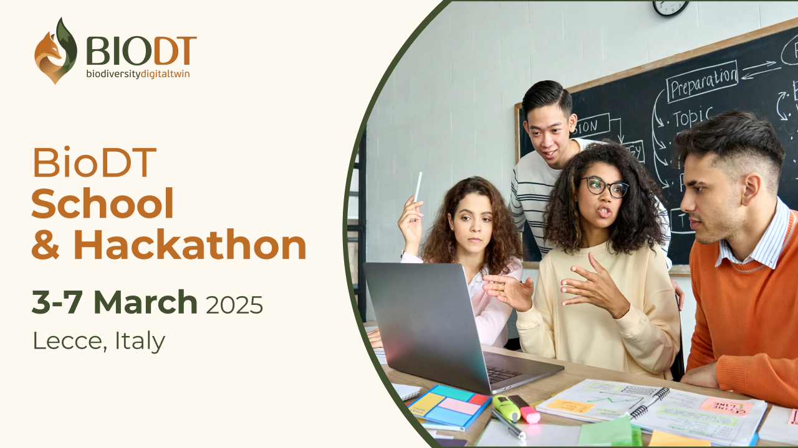

# BioDT School & Hackathon 2025

This is the central repository of training material that will be used during the BioDT School and Hackathon 2025.

## Instructions

- Please see the material in the LifeWatch ERIC Training Platform
- Each sub-directory has the material relevant for different sessions throughout the school and hackathon. The instructors will guide you the the correct directory for their respective sessions.
- Please use the [issues](https://github.com/BioDT/Hackathon25/issues) on this repository for feedback to the different material.

## License

This project is licensed under the MIT License - see the [LICENSE](LICENSE) file for details.
