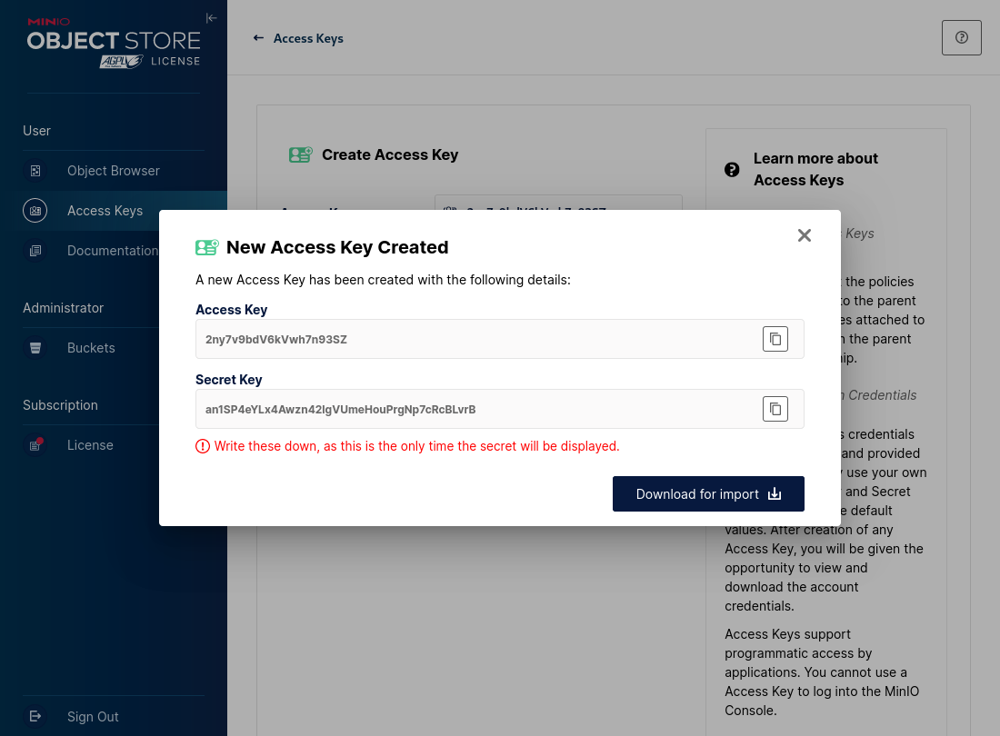

# BioDT School & Hackathon 2025


This is the central repository of training material that will be used during the BioDT School and Hackathon 2025.


## NaaVRE Documentation

The documentation of the NaaVRE project can be found [here](https://naavre.net/).


## Saving files in NaaVRE workflows with MinIO

## MinIO Setup

1. Open [MinIO login](https://scruffy.lab.uvalight.net:9001/login)
2. Click on **"Login with SSO (vre)"**


**⚠ Warning:**  
This service is intended for testing and development purposes.  
It is maintained by the LifeWatch VLIC team as “best effort.”  
- There is **no guarantee** that your data is safe or that the service will be available.  
- **Use at your own risk** and keep backups of important data.

---


### MinIO Access
Choose an identity provider and login:


- **Buckets available:**
  - `naa-vre-public` (read-only)
  - `naa-vre-user-data` (read/write access to a folder with your username, e.g., `myname@gmail.com`)

---


### Create an Access Key

1. Select **"Access Keys"**
2. Click **"Create access key"**
3. Click **"Create"**
4. **Save the keys for later!**

---




## Use MinIO in NaaVRE

1. Open your favorite VRE (see **NaaVRE Getting Started tutorial**)
2. Create a new notebook

---


## R Example

```r
# Configuration (do not containerize this cell)
param_minio_endpoint  = "scruffy.lab.uvalight.net:9000"
param_minio_region  = "nl-uvalight"
param_minio_user_prefix  = "myname@gmail.com"  # Your personal folder in the naa-vre-user-data bucket
secret_minio_access_key   = "2ny7v9bdV6kVwh7n93SZ"
secret_minio_secret_key   = "an1SP4eYLx4Awzn42lgVUmeHouPrgNp7cRcBLvrB"
```
```r
# Access MinIO files
install.packages("aws.s3")
library("aws.s3")

Sys.setenv(
  "AWS_S3_ENDPOINT"  = param_minio_endpoint,
  "AWS_DEFAULT_REGION" = param_minio_region,
  "AWS_ACCESS_KEY_ID" = secret_minio_access_key,
  "AWS_SECRET_ACCESS_KEY" = secret_minio_secret_key
)

# List existing buckets
bucketlist()

# List files in your personal folder in MinIO
get_bucket_df(bucket = "naa-vre-user-data", prefix = paste0(param_minio_user_prefix, "/"))

# Upload file to MinIO
put_object(
  bucket = "naa-vre-user-data",
  file = "myfile_local.csv",
  object = paste0(param_minio_user_prefix, "/myfile.csv")
)

# Download file from MinIO
save_object(
  bucket = "naa-vre-user-data",
  object = paste0(param_minio_user_prefix, "/myfile.csv"),
  file = "myfile_downloaded.csv"
)

```

## Python example

```python
# Configuration (do not containerize this cell)
param_minio_endpoint = "scruffy.lab.uvalight.net:9000"
param_minio_user_prefix = "myname@gmail.com"  # Your personal folder in the naa-vre-user-data bucket in MinIO
secret_minio_access_key = "2ny7v9bdV6kVwh7n93SZ"
secret_minio_secret_key = "an1SP4eYLx4Awzn42lgVUmeHouPrgNp7cRcBLvrB"
```

```python
# Access MinIO files
from minio import Minio
mc = Minio(endpoint=param_minio_endpoint,
           access_key=secret_minio_access_key,
           secret_key=secret_minio_secret_key)

# List existing buckets: get a list of all available buckets
mc.list_buckets()

# List files in bucket: get a list of files in a given bucket. For bucket `naa-vre-user-data`, only list files in your personal folder
objects = mc.list_objects("naa-vre-user-data", prefix=f"{param_minio_user_prefix}/")
for obj in objects:
    print(obj.object_name)

# Upload file to bucket: uploads `myfile_local.csv` to your personal folder on MinIO as `myfile.csv`
mc.fput_object(bucket_name="naa-vre-user-data", file_path="myfile_local.csv", object_name=f"{param_minio_user_prefix}/myfile.csv")

# Download file from bucket: download `myfile.csv` from your personal folder on MinIO and save it locally as `myfile_downloaded.csv`
mc.fget_object(bucket_name="naa-vre-user-data", object_name=f"{param_minio_user_prefix}/myfile.csv", file_path="myfile_downloaded.csv")
```

## License

This project is licensed under the MIT License - see the [LICENSE](LICENSE) file for details.
